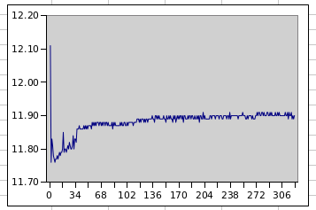
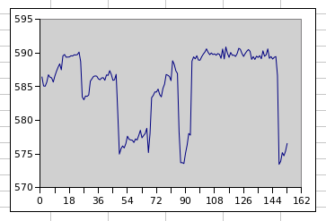

## Fast "sqrt(-1) (mod p)" for 9,383,761-digit prime p =1 (mod 4)

I will leave below sections for history, but I stopped the long 75.4 days expected run on Sunday after 9d 20.9h:  
```
hermann@7600x:~/9383761-digit-prime$ uptime
 14:30:02 up 9 days, 20:56,  1 user,  load average: 0.85, 0.97, 0.99
hermann@7600x:~/9383761-digit-prime$
```

Reason was that I learned about llr tool ([binaries and source](http://jpenne.free.fr/index2.html)) based on gwnum library, which can speedup computation massively using AVX512 instructions and parallelism. While repeated squarings (mod p) cannot be parallelized, a single square or square+mult (mod p) can be parallelized using FFTs. And 31,172,177 such operations had to be done ...

You find details on the determination in 13.2h plus 10s post processing in this posting:  
https://mersenneforum.org/showthread.php?p=635482#post635482  
That is 137× faster than 75.4 days!  

LLR tools above version 3.8.21 do not work on AMD64 CPUs. I patched 3.8.21 LLR to access *sqrt(-1) (mod p)* at end of computation. And the 7600X CPU with ```-t6``` LLR option did complete in only 10:45:01h(!). That is 168× faster than 75.4 days, and apples to apples comparison on same hardware; details here:  
https://github.com/Hermann-SW/RSA_numbers_factored/tree/main/llr#readme

\<NEW date="1/26/2024">  
I did factor this prime on AMD 7950X CPU in only 8:24:37h(!), with <kbd>-t6</kbd> LLR option as well, details here:  
https://mersenneforum.org/showthread.php?p=648945#post648945  
\</NEW>

When I started this project, 9,383,761-digit prime was largest known prime =1 (mod 4). On 7/25/2023 a larger 11,887,192-digit prime =1 (mod 4) was proven and published, see [this repo](https://github.com/Hermann-SW/11887192-digit-prime#motivation) on 6.7days computation for that prime.


The 9,383,761-digit prime is largest of 6 Colbert numbers:  
https://oeis.org/A258074

I created new repo for those, containing entries [k,n,s,x,y] with p=k*2^n+1, s^2%p==p-1 and p==x^2+y^2:  
https://github.com/Hermann-SW/Colbert_numbers


The determined "sqrt(-1) (mod p)" is defined as constant "sqrtm1" in this PARI/GP script:  
https://github.com/Hermann-SW/RSA_numbers_factored/blob/main/pari/sqrtm1.9383761_digit.second_largest_known_1mod4_prime.gp

And what I wanted to compute, the unique sum of squares p=x^2+y^2 for the 9,383,761-digit prime p was done in just 2.9s given sqrtm1(!).
x and y constants can be found in [this C++ script](https://github.com/Hermann-SW/RSA_numbers_factored/blob/main/c%2B%2B/sqrtm1.9383761_digit.second_largest_known_1mod4_prime.cc).  

Also computation of sqrtm1 given x and y can be done in 4.2s for that huge prime number:  
```
hermann@7600x:~/RSA_numbers_factored/pari$ gp -q
? \r sqrtm1.9383761_digit.second_largest_known_1mod4_prime
9383761-digit prime p (31172179 bits)
[M,V] = halfgcd(sqrtm1, p)
  ***   last result computed in 2,854 ms.
[x,y] = [V[2], M[2,1]]
  ***   last result computed in 1 ms.
sqrtm1 = lift(Mod(x/y, p))
  ***   last result computed in 5,929 ms.
sqrtm1 = lift(x*Mod(1/y, p))
  ***   last result computed in 4,531 ms.
sqrtm1 = lift(Mod(x, p)/y)
  ***   last result computed in 4,203 ms.
done, all asserts OK
?
```

Same computations can be done with libgmpxx and libpari in C++. Same time for computing sqrtm1 from unique sum of squares p=x^2+y^2, a bit slower for the other direction [most likely due to conversion overhead calling libpari function halfgcdii())]:  
https://github.com/Hermann-SW/RSA_numbers_factored/blob/main/c%2B%2B/sqrtm1.9383761_digit.largest_known_1mod4_prime.cc
```
$ f=sqrtm1.9383761_digit.largest_known_1mod4_prime
$ g++ $f.cc -lgmp -lgmpxx -O3 -o $f -lpari -DPARI
$ ./$f
a = y^(-1) (mod p) [powm]; a *= x; a %= p
4.22922s
[M,V] = halfgcdii(sqrtm1, p)
3.71779s
[x,y] = [V[2], M[2,1]]
1e-06s
done
$
```

Total power consumption at just below 80W in 9d 20.9h was 18.47KWh, or 1.87KWh/day (with >50% green power from roof top solar collectors).  


## Build and install

```
make [TEST]
```

Add these two root crontab entries, with path adjusted to your repo location:  
```
$ sudo crontab -l | grep -v "^#"
@reboot /home/hermann/9383761-digit-prime/doit &
* * * * * [ ! -f /tmp/startdoit ] || /home/hermann/9383761-digit-prime/doit &
$ 
```
See section [hotfix](#hotfix) on why the second entry is needed.

In Bios set "Restore on AC/Power Loss" to "Power ON".
Have 90MB free disk space for TEST run (1.1h), 100GB free disk space for real run (75 days), both on 7600X CPU.
Initially remove all "\*.job" files, and then reboot to start.

See section [TEST](#test) below, and section [75 days sequential computation](#75-days-sequential-computation) — it has started already:  
```
$ stat 9383761-digit-prime/0.job | grep Birth
 Birth: 2023-07-20 17:33:45.443004722 +0200
$
```
Finally section [Power consumption](#power-consumption) forecasts power consumption of 75 days computation as 150KWh, with more than half powered green from roof top solar power.

## Motivation

I was an ultramarathon runner [when I was younger](https://statistik.d-u-v.org/getresultperson.php?runner=2493&Language=EN), and this repo is all about making my new AMD Ryzen 5 7600X CPU PC do an ultramarathon (sequential) computation of 70+ days!  

## Why 7600X CPU?
That CPU is rank 18 (4,221 CPU Mark, much more expensive rank 1 has 4,791) of PassMark Software's >3100 CPUs [Single Thread Performance](https://www.cpubenchmark.net/singleThread.html) list. Linux, macOS and mobile versions of PerformanceTEST are free. PerformanceTEST reports this on my Ubuntu 22.04 Desktop PC, not far away from list value:
```
...
CPU Single Threaded              4173 Million Operations/s
...
```

7600X CPU shows 2nd place on gmpbench list (sequential pure integer benchmark of GNU Multiple Precision arithmetic library):  
https://gmplib.org/gmpbench  
https://gmplib.org/list-archives/gmp-devel/2023-July/006184.html

More details on the PC used:  
https://github.com/Hermann-SW/7600X

## *sqrt(-1) (mod p)* for 9,383,761-digit prime p

Rank 9 of [THE LARGEST KNOWN PRIMES](https://t5k.org/primes/lists/all.txt) list is 9,383,761 decimal digit number *p=10223\*2^31172165+1*. It is the largest known prime *=1 (mod 4)*. For such primes there exists *sqrt(-1) (mod p)*, which is what the PC will compute. It does so by computing *3^((p-1)/4) (mod p)*, normally with just libgmpxx function call *mpz_powm(res, 3, (p-1)/4, p)*. Value *3* because it is (smallest) quadratic non-residue mod p. The exponent can be rewritten as *(p-1)/4 = (2^31172163)^10223*. So GMP library will have to do 31,172,163 squarings mod p, and then a fast exponentiation by less than *2^14* exponent. Doing 70+ days computation with a single GMP function call is a bit risky at least, as any interruption would require start from begin.

## Previous runtimes for up to 1,000,000-digit primes

I did compute *sqrt(-1) (mod p)* for lowest known 1,000,000 decimal digit prime before. With i7-11850H CPU that computation took 26.01h (19h expected for 7600X CPU based on runtimes for up to 388,342-digit prime):  


## Upper bound on 70+ days computation

I did compute upper bound of 74.13 days for computing *sqrt(-1) (mod p)* for the more than 9million-digit prime:  
[https://gmplib.org/list-archives/gmp-devel/2023-July/006189.html](https://gmplib.org/list-archives/gmp-devel/2023-July/006189.html)

## Basement ceiling computing center for 70+ days

For 70+ days sequential computation I decided not to use the UPS that I recently bought. It is able to continue PC operation with single thread running for 17:58min. But we have really seldom power outages here in Germany. Interestingly parts of my town had one recently (7/17/2023). We had no mains power for more than 2 hours, so the UPS I have would not have helped.

Instead the big computation is split into *loops* smaller jobs of *sqspl* squarings *(mod p)* [with loops \* sqspl == 31,172,163], and final small exponentiation *(mod p)* with exponent *10223*. Each job will store its result. Bios "Restore on AC/Power Loss" is set to "Power ON", and crontab "@reboot" will continue computation where it was interrupted, if such an interrupt will happen at all (if I will need to do an important other computation on that PC, I might kill the long computation, do whatever is needed, and finally "sudo reboot 0" will continue the big computation).

|in the dark|with flash|
|-----------|----------|
|||


## TEST

This diagram shows runtimes [s] for the jobs 1..322 of determining *sqrt(-1) (mod p)* for 272770-digit prime p. This much smaller prime results in total runtime of just above 1 hour (1689839637.20 - 1689835811.49 = 1:03:45.71h), instead of 75 days for the real run:  
  
The runtime epoch timestamp from just before job *x* and after job *x* are here, for 0<=x<=323. 0.job contains just "3\n", 1.job contains *3^(2^2403) (mod p)* and 323.job contains *sqrt(-1) (mod p)*:  
[TEST/tstamps.txt](https://github.com/Hermann-SW/9383761-digit-prime/blob/main/TEST/tstamps.txt)  
[TEST/0.job](https://github.com/Hermann-SW/9383761-digit-prime/blob/main/TEST/0.job)  
[TEST/1.job](https://github.com/Hermann-SW/9383761-digit-prime/blob/main/TEST/1.job)  
[TEST/323.job](https://github.com/Hermann-SW/9383761-digit-prime/blob/main/TEST/323.job)  

## 75 days sequential computation

Has started:

```
$ stat 9383761-digit-prime/0.job | grep Birth
 Birth: 2023-07-20 17:33:45.443004722 +0200
$
```

This diagram shows runtimes [s] for the jobs 1..153 of determining sqrt(-1) (mod p) for 9,383761-digit prime p, that completed in first 24h. Unlike the nearly same runtimes per job for TEST, here runtimes differ a bit: 573.5/585.4/590.9 seconds min/avg/max (-2.0%..+3.0%). Forecast for 11122 jobs is 585.4\*11122/3600/24 = 75.4 days minimal runtime:  


From 7600x PC ```journalctl``` command, first entry just a second before 0.job birth timestamp:  
```
-- Boot 51c723b1665044ddab991b1491b2b340 --
Jul 20 17:33:44 7600x kernel: Linux version 5.19.0-46-generic (buildd@lcy02-amd64-025) (x86_64-linux-gnu-gcc (Ubuntu 11.3.0-1ubuntu1~22.04.1) ...
```

I had SSH key-based login configured, no need to login for uptime (load 1.00 is exactly as it should):
```
pi@pi400-64:~ $ ssh hermann@7600x uptime
 20:06:09 up 1 day,  2:32,  0 users,  load average: 1.01, 1.02, 1.00
pi@pi400-64:~ $ 
```

## hotfix

After more than 40 hours runtime, I spotted a small bug in [job.cc](https://github.com/Hermann-SW/9383761-digit-prime/blob/main/). The command ```c = mpz_class(1705);``` was a mistake, 1705 was factor ```fact``` from successful TEST run. In more than 70 days from now, when the 11121 loops are completed, the final exponentiation would be done with ```1705``` instead of the needed ```10223```, and the following ```assert(a * a % p == p - 1);``` will fail. 

I could have fixed then, but decided to do it now. I learned that better not change a linux executable while running, and most likely better not change a bash script while running. I wanted to keep the uptime, so instead reboot a restart of cron was done by hotfix tool.

New hotfix tool, new status.log, and the small change in job.cc and in doit can be seen in commit [f883474](https://github.com/Hermann-SW/9383761-digit-prime/commit/f883474da7ddf197daa8a02d493e39545e743263). While changing job.cc was fine without compiling, modified doit was stored in doit.new, to be handled by hotfix tool.

After lot of testing on different computer to be sure that hotfix will work, I finally did it on 7600X PC:  
```
hermann@7600x:~/9383761-digit-prime$ sudo ./hotfix
waiting for job 297 to complete
rm -f job
g++ job.cc -lgmp -lgmpxx -O3 -Wall -pedantic -Wextra -o job
waiting for doit to restart
hermann@7600x:~/9383761-digit-prime$ 
```

New status.log shows what happened reboot/hotfix wise:  
```
hermann@7600x:~/9383761-digit-prime$ cat status.log 
0.log Birth: 2023-07-20 17:33:45.443004722 +0200

Jul 22 17:43:47 7600x hotfix[628793]: started
Jul 22 17:46:01 7600x doit[629454]: started
Jul 22 17:46:01 7600x hotfix[628793]: done
hermann@7600x:~/9383761-digit-prime$
```

uptime is bigger than 2 days, but doit and job processes were started newly 17:46  
```
hermann@7600x:~/9383761-digit-prime$ uptime
 17:51:02 up 2 days, 17 min,  1 user,  load average: 1.00, 1.00, 1.00
hermann@7600x:~/9383761-digit-prime$ ps -ef | grep job
root      629465  629454 99 17:46 ?        00:05:24 ./job 297
hermann   630642  627106  0 17:51 pts/0    00:00:00 grep --color=auto job
hermann@7600x:~/9383761-digit-prime$ ps -ef | grep doit
root      629454       1  0 17:46 ?        00:00:00 /bin/bash /home/hermann/9383761-digit-prime/doit
hermann   630710  627106  0 17:51 pts/0    00:00:00 grep --color=auto doit
hermann@7600x:~/9383761-digit-prime$
```

After hotfix waited for the current job to complete, it did kill ```doit``` and ```job```. In case file doit.new is present, it gets moved to doit. Then job.cc gets compiled for new executable. Then /tmp/startdoit gets touched, and the 2nd root crontab line does the job to start doit from cron:
```
$ sudo crontab -l | grep -v "^#"
@reboot /home/hermann/9383761-digit-prime/doit &
* * * * * [ ! -f /tmp/startdoit ] || /home/hermann/9383761-digit-prime/doit &
$ 
```
After having waited for doit to start, /tmp/startdoit gets removed to not start doit again on next minute.

And what is the result of all this hotfix stuff?  
Less than 10 seconds of computation time is lost only!  
Normally Modify timestamp of a job is equal to Birth timestamp of following one.  
After hotfix both timestamps are less than 10 seconds apart:  
```
hermann@7600x:~/9383761-digit-prime$ stat 297.job | grep Modify
Modify: 2023-07-22 17:45:52.104188350 +0200
hermann@7600x:~/9383761-digit-prime$ stat 298.job | grep Birth
 Birth: 2023-07-22 17:46:01.728445777 +0200
hermann@7600x:~/9383761-digit-prime$ 
```

## Power consumption

Photos taken 3min/24h after electricity meter and PC got powered:  
   
Power factor 1.00, power consumption 78W and in total 1.95KWh consumed in 24h.

Total energy consumption will be 2KWh/day or 150KWh for expected 75 days computation.

We have solar power on roof top, and on good days (25KWh)  
  
as well as on not so good days (13.9KWh),  
  
80W = 0.08KW are easily produced for more than 12 hours per day. So more than half of the computation is green.
