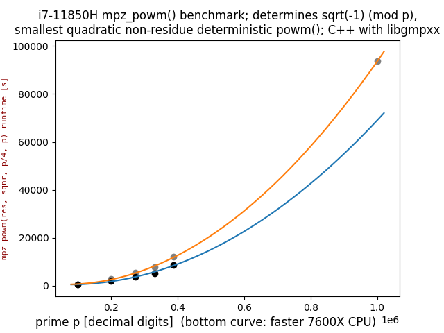

## Motivation

I was an ultramarathon runner [when I was younger](https://statistik.d-u-v.org/getresultperson.php?runner=2493&Language=EN), and this repo is all about making my new AMD Ryzen 5 7600X CPU PC do an ultramarathon (sequential) computation of 70+ days!  

## Why 7600X CPU?
That CPU is rank 18 (4,221 CPU Mark, much more expensive rank 1 has 4,791) of PassMark Software's >3100 CPUs [Single Thread Performance](https://www.cpubenchmark.net/singleThread.html) list. Linux, macOS and mobile versions of PerformanceTEST are free. PerformanceTEST reports this on my Ubuntu 22.04 Desktop PC, not far away from list value:
```
...
CPU Single Threaded              4173 Million Operations/s
...
```

7600X CPU shows 2nd place on gmpbench list (sequential pure integer benchmark of GNU Multiple Precision arithmetic library):  
https://gmplib.org/gmpbench  
https://gmplib.org/list-archives/gmp-devel/2023-July/006184.html

More details on the PC used:  
https://github.com/Hermann-SW/7600X

## *sqrt(-1) (mod p)* for 9,383,761-digit prime p

Rank 9 of [THE LARGEST KNOWN PRIMES](https://t5k.org/primes/lists/all.txt) list is 9,383,761 decimal digit number *p=10223\*2^31172165+1*. It is the largest known prime *=1 (mod 4)*. For such primes there exists *sqrt(-1) (mod p)*, which is what the PC will compute. It does so by computing *3^((p-1)/4) (mod p)*, normally with just libgmpxx function call *mpz_powm(res, 3, (p-1)/4, p)*. Value *3* because it is (smallest) quadratic non-residue mod p. The exponent can be rewritten as *(p-1)/4 = (2^31172163)^10223*. So GMP library will have to do 31,172,163 squarings mod p, and then a fast exponentiation by less than *2^14* exponent. Doing 70+ days computation with a single GMP function call is a bit risky at least, as any interruption would require start from begin.

## Previous runtimes for up to 1,000,000-digit primes

I did compute *sqrt(-1) (mod p)* for lowest known 1,000,000 decimal digit prime before. With i7-11850H CPU that computation took 26.01h (19h expected for 7600X CPU based on runtimes for up to 388,342-digit prime):  


## Upper bound on 70+ days computation

I did compute upper bound of 74.13 days for computing *sqrt(-1) (mod p)* for the more than 9million-digit prime:  
[https://gmplib.org/list-archives/gmp-devel/2023-July/006189.html](https://gmplib.org/list-archives/gmp-devel/2023-July/006189.html)

## Basement ceiling computing center for 70+ days

For 70+ days sequential computation I decided not to use the UPS that I recently bought. It is able to continue PC operation with single thread running for 17:58min. But we have really seldom power outages here in Germany. Interestingly parts of my town had one recently (7/17/2023). We had no mains power for more than 2 hours, so the UPS I have would not have helped.

Instead the big computation is split into *loops* smaller jobs of *sqspl* squarings *(mod p)* [with loops \* sqspl == 31,172,163], and final small exponentiation *(mod p)* with exponent *10223*. Each job will store its result. Bios "Restore on AC/Power Loss" is set to "Power ON", and crontab "@reboot" will continue computation where it was interrupted, if such an interrupt will happen at all (if I will need to do an important other computation on that PC, I might kill the long computation, do whatever is needed, and finally "sudo reboot 0" will continue the big computation).

|in the dark|with flash|
|-----------|----------|
|||
